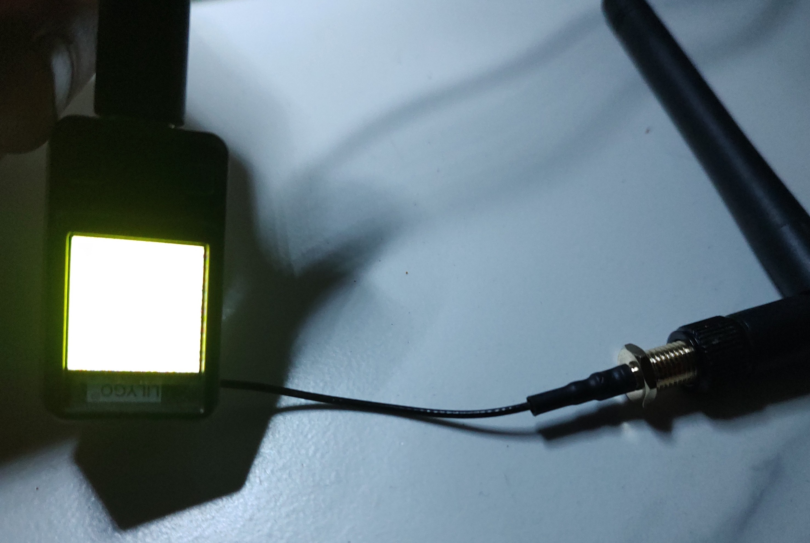
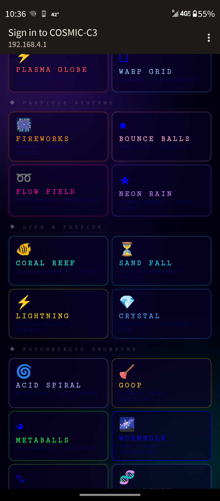
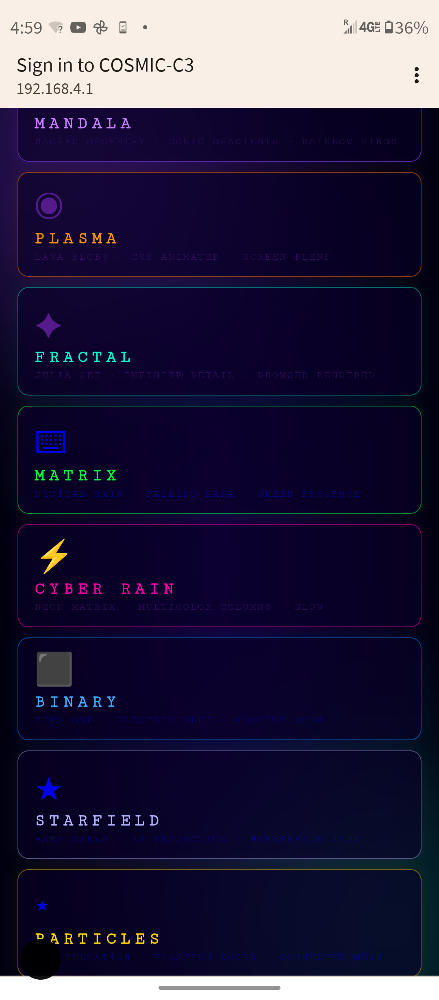
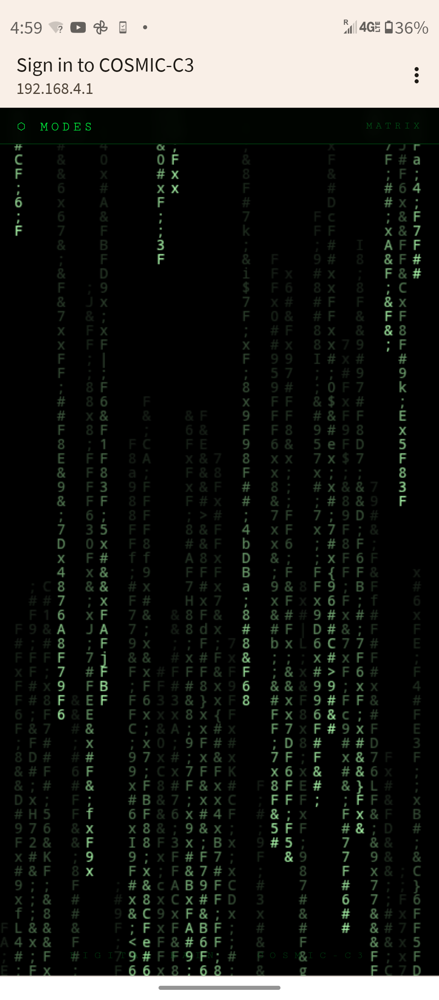
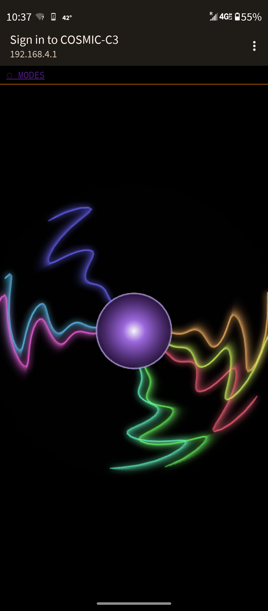
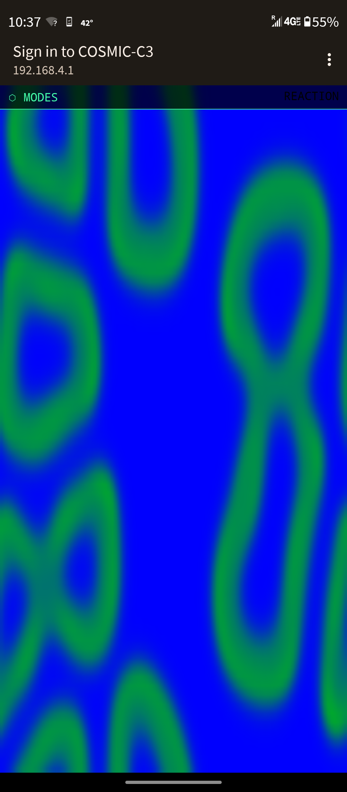
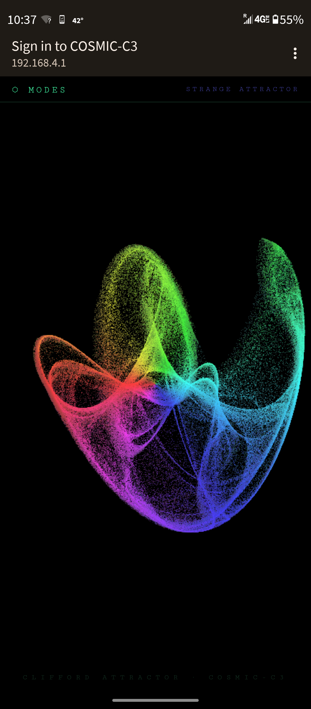

# COSMIC-S3 FREE ART PORTAL 🎨 — T-QT Pro Edition

A pocket-sized WiFi captive portal art gallery running on the **LilyGO T-QT Pro ESP32-S3**. Connect to the access point and your phone auto-launches a full-screen interactive art gallery — no internet required, no app, no login.

60+ modes spanning mathematical attractors, generative fractals, physics simulations, ambient animations, and playable games — all rendered entirely in the mobile browser. The T-QT Pro just serves static HTML, and its tiny circular display acts as a live status screen you can use to send messages to visitors.

---

## Hardware Photo

| | |
|---|---|
|  | |
| *LilyGO T-QT Pro with external antenna — display glowing during connected-visitor flash mode* | |

---

## Portal Screenshots

| | |
|---|---|
|  |  |
| *Strange Attractor — rainbow Clifford attractor plotted live* | *Mode selector — the portal landing page* |
|  |  |
| *Matrix Rain — triggered automatically by captive portal on Android* | *Tetris — fully playable with touch d-pad* |
|  |  |
| *Conway's Game of Life — random seed, live simulation* | *Kaleidoscope — mirrored canvas art* |

---

## Hardware

| Part | Detail |
|---|---|
| Board | LilyGO T-QT Pro |
| MCU | ESP32-S3 (240 MHz, 320 KB RAM, 2 MB PSRAM) |
| Display | 0.85" 128×128 GC9A01 circular TFT |
| Flash | 4 MB (N4R2 variant) |
| WiFi | AP mode — 2.4 GHz, no password |
| SSID | `COSMIC-S3 FREE ART PORTAL 🎨` |
| IP | `192.168.4.1` |
| Left button | GPIO 0 (BOOT) |
| Right button | GPIO 47 |

The T-QT Pro has an IPEX antenna connector — adding an external antenna noticeably improves range for an art installation or public space deployment.

---

## Display States

The tiny screen doubles as a live status indicator:

| State | What you see |
|---|---|
| **Idle** — no visitors | Slow rainbow colour breathe with inner halo. "COSMIC PORTAL / WAITING..." |
| **Connected** — visitor on AP | Rapid vivid colour flash cycling through 8 colours. Shows visitor count + "CONNECTED" |
| **Message menu** | Dark overlay listing 5 pre-saved messages. Selected row highlighted in purple |
| **Sent confirm** | Green flash "SENT!" for 1.5 s, then back to status |

---

## Button Controls

| Button | State | Action |
|---|---|---|
| Either | Idle / Confirm | Open message menu |
| **Left (GPIO 0)** | Menu open | Scroll to next message |
| **Right (GPIO 47)** | Menu open | Send selected message → portal toast |

### Pre-Saved Messages

| Menu label | Toast shown on visitor's portal page |
|---|---|
| Welcome! | Welcome to the Cosmic Portal! 🎨 |
| Enjoy the art! | Enjoy the art - try all 60+ modes! |
| Secret gallery! | You found a secret WiFi art gallery! |
| Hi there! | Hi there! Browse freely :) |
| Cosmic greets! | Greetings, cosmic traveler! ✨ |

Messages appear as a floating purple-glow notification on the visitor's screen for 5 seconds. The portal polls silently every 2.5 s — no page refresh needed.

---

## Build & Flash

Requires [PlatformIO](https://platformio.org/).

```bash
# Build (4 MB + 2 MB PSRAM variant)
pio run -e T-QT-Pro-N4R2

# Upload
pio run -e T-QT-Pro-N4R2 -t upload

# Monitor serial
pio device monitor
```

For the 8 MB no-PSRAM variant:
```bash
pio run -e T-QT-Pro-N8 -t upload
```

> **First upload:** hold the BOOT button while the upload starts, then release.

---

## Project Structure

```
COSMICQT/
├── boards/
│   ├── esp32-s3-t-qt-pro.json      Custom board definition (4MB+PSRAM)
│   └── esp32-s3-t-qt-pro-n8.json  Custom board definition (8MB no PSRAM)
├── platformio.ini                  TFT_eSPI via build_flags — no header edits needed
├── src/
│   └── main.cpp                    Full portal + display + buttons — single file
└── README.md
```

TFT_eSPI is configured entirely through `build_flags` — no manual library header edits required. The board definitions are self-contained in `boards/`.

---

## How It Works

1. T-QT Pro boots → display shows "COSMIC PORTAL / STARTING…"
2. WiFi AP starts broadcasting `COSMIC-S3 FREE ART PORTAL 🎨`
3. Display shows "PORTAL READY / 192.168.4.1" for 1.5 s then enters idle rainbow breathe
4. Visitor connects → OS detects no internet → captive portal browser opens automatically
5. Display switches to vivid colour flash + visitor count
6. You press either button → message menu appears on the circular screen
7. Left = scroll through messages, Right = send → toast appears on visitor's portal page
8. Display shows "SENT!" for 1.5 s then returns to active state

Everything is a single `main.cpp` — no SPIFFS, no external libraries beyond TFT_eSPI and the standard ESP32 Arduino stack.

---

## Differences from C3WiFi Edition

| Feature | C3WiFi (ESP32-C3 Super Mini) | COSMIC-S3 (T-QT Pro) |
|---|---|---|
| Status indicator | GPIO 8 onboard LED | 128×128 colour circular display |
| Connected indicator | Fast LED strobe | Vivid 8-colour rainbow flash |
| Visitor count | None | Shown large on display |
| Messages to visitors | None | Button menu → portal toast |
| External antenna | No | Yes (IPEX connector) |
| RAM | 320 KB | 320 KB + 2 MB PSRAM |
| CPU | 160 MHz single-core | 240 MHz dual-core |
